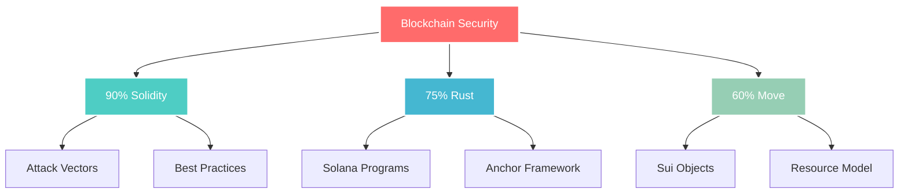

# <div align="center">
  
</div>

<div align="center">
  
  [](https://git.io/typing-svg)
  
</div>

<div align="center">
  <a href="https://yoursbyte.dev"></a>
  <a href="https://twitter.com/yoursbyte"></a>
  <a href="https://linkedin.com/in/yoursbyte"></a>
  <a href="mailto:yoursbyte@proton.me"></a>
  <a href="https://github.com/yoursbyte"></a>
</div>

<br>

<div align="center">
  
  
  
</div>

---

##  **About Me**

```typescript
const yoursbyte: BlockchainSecurityResearcher = {
    identity: {
        name: "YoursByte",
        role: "Aspiring Security Researcher",
        mission: "Making Web3 Safer, One Audit at a Time",
        location: "Distributed",
        timezone: "UTC"
    },
    
    expertise: {
        smartContracts: ["Solidity", "Rust", "Move"],
        blockchains: ["Ethereum", "Solana", "Sui", "Polygon", "Arbitrum"],
        tools: ["Foundry", "Hardhat", "Slither", "Mythril", "Echidna"],
        languages: ["TypeScript", "Python", "Rust", "Go"],
        specialization: "DeFi Security & MEV Research"
    },
    
    currentFocus: {
        learning: ["Advanced DeFi Protocols", "Zero-Knowledge Proofs", "MEV Strategies"],
        building: ["Automated Vulnerability Scanner", "Security Dashboard"],
        researching: ["Cross-Chain Bridge Exploits", "Flash Loan Attack Vectors"]
    },
    
    achievements: {
        ethernautLevels: 15,
        damnVulnerableDefi: 8,
        captureTheEther: 12,
        practiceAudits: 5,
        bugsFound: "Loading... 🔍"
    }
};
```

---

## 🎯 **Core Competencies**

<table>
<tr>
<td width="50%">

### ⚔️ **Security Expertise**


**Smart Contract Auditing**
- 🔍 Static & Dynamic Analysis
- 🛡️ Formal Verification Basics
- ⚡ Gas Optimization Patterns
- 🔐 Access Control Reviews

**Vulnerability Research**
- 💣 Reentrancy Attacks
- 🎯 Integer Overflow/Underflow
- 🌊 Flash Loan Exploits
- 🔄 Front-Running & MEV

</td>
<td width="50%">

### 🛠️ **Technical Stack**


**Development Tools**
```
├── 🔧 Foundry & Forge
├── ⚙️ Hardhat & Truffle
├── 🧪 Brownie & Ape
├── 🔍 Tenderly & Etherscan
└── 📊 Dune Analytics
```

**Security Arsenal**
```
├── 🐍 Slither & Mythril
├── 🦎 Echidna & Medusa
├── 🔬 Manticore & Oyente
├── 🎯 Securify & MythX
└── ⚡ Custom Fuzzing Tools
```

</td>
</tr>
</table>

---

## 📈 **Security Journey Progress**

<div align="center">

### 🏆 **2024 Milestones Tracker**

| Quarter | Target | Progress | Status |
|:-------:|:------:|:--------:|:------:|
| **Q1** | Master Solidity Security | ████████████████████ 100% | ✅ Complete |
| **Q2** | Complete CTF Challenges | ████████████████░░░░ 80% | 🔄 In Progress |
| **Q3** | First Bug Bounty | ████████░░░░░░░░░░░░ 40% | 📊 Researching |
| **Q4** | Junior Auditor Position | ██░░░░░░░░░░░░░░░░░░ 10% | 🎯 Preparing |

### 📊 **Skills Proficiency Matrix**



</div>

---

## 🚀 **Featured Projects**

<table>
<tr>
<td width="33%" align="center">

### 🔐 **DeFi Vulnerability Scanner**
[](https://github.com/yoursbyte/defi-scanner)

**Automated Security Analysis Tool**
- Real-time vulnerability detection
- 15+ attack vector checks
- Gas optimization suggestions
- Slither & Mythril integration

**Tech:** Solidity, Python, Web3.js

[View Project →](https://github.com/yoursbyte/defi-scanner)

</td>
<td width="33%" align="center">

### 💎 **Smart Contract Audit Reports**
[](https://github.com/yoursbyte/audit-reports)

**Professional Security Assessments**
- Comprehensive code review
- Risk classification matrix
- Detailed PoC exploits
- Remediation guidelines

**Focus:** DeFi, NFT, DAO

[View Reports →](https://github.com/yoursbyte/audit-reports)

</td>
<td width="33%" align="center">

### ⚡ **MEV Bot Research**
[](https://github.com/yoursbyte/mev-research)

**Maximal Extractable Value Studies**
- Arbitrage bot development
- Sandwich attack analysis
- Flashbot integration
- Performance optimization

**Stack:** Rust, Go, Flashbots

[View Research →](https://github.com/yoursbyte/mev-research)

</td>
</tr>
</table>

---

## 🎓 **Certifications & Education**

<div align="center">

| 🏅 **Certification** | 🏛️ **Institution** | 📅 **Year** | 🔗 **Verify** |
|:-------------------:|:------------------:|:-----------:|:-------------:|
| **Blockchain Security Specialist** | Consensys Academy | 2024 | [Certificate](https://verify.consensys.net/yoursbyte) |
| **Smart Contract Auditor** | OpenZeppelin | 2024 | [Certificate](https://certificates.openzeppelin.com/yoursbyte) |
| **Ethereum Developer** | Alchemy University | 2024 | [Certificate](https://university.alchemy.com/yoursbyte) |
| **Solidity Expert** | CryptoZombies | 2023 | [Certificate](https://cryptozombies.io/yoursbyte) |
| **DeFi Security** | Immunefi | 2023 | [Certificate](https://immunefi.com/yoursbyte) |

</div>

---

## 📚 **Learning Resources & Contributions**

<details>
<summary><b>📖 Click to expand my curated security resources</b></summary>

### 🔍 **Security Tools I've Built/Contributed To**

- **[Vulnerability Pattern Detector](https://github.com/yoursbyte/vuln-detector)** - ML-based pattern recognition for smart contracts
- **[Gas Optimization Analyzer](https://github.com/yoursbyte/gas-analyzer)** - Automated gas efficiency scanner
- **[Flash Loan Simulator](https://github.com/yoursbyte/flash-sim)** - Testing environment for flash loan attacks

### 📚 **My Security Knowledge Base**

- **[Smart Contract Security Checklist](https://github.com/yoursbyte/security-checklist)** - 200+ security considerations
- **[DeFi Hack Analysis Collection](https://github.com/yoursbyte/defi-hacks)** - Post-mortems of major exploits
- **[Solidity Security Patterns](https://github.com/yoursbyte/patterns)** - Best practices and anti-patterns

### 🎯 **CTF Writeups & Solutions**

- **Ethernaut:** [15/32 Levels Completed](https://github.com/yoursbyte/ethernaut-solutions)
- **Damn Vulnerable DeFi:** [8/15 Challenges Solved](https://github.com/yoursbyte/dvd-solutions)
- **Capture The Ether:** [12/20 Puzzles Cracked](https://github.com/yoursbyte/cte-solutions)

</details>

---

## 📊 **GitHub Analytics**

<div align="center">
  
  
</div>

<div align="center">
  
</div>

<div align="center">
  
</div>

---

## 🤝 **Let's Build a Safer Web3 Together**

<div align="center">

### 💼 **Open for Opportunities**

<table>
<tr>
<td align="center">

**🎯 Seeking**
- Junior Security Auditor roles
- Bug bounty collaborations
- Open-source security projects
- Mentorship opportunities

</td>
<td align="center">

**💡 Offering**
- Smart contract reviews
- Security best practices consulting
- Educational content creation
- Community workshop hosting

</td>
<td align="center">

**🌟 Interests**
- Zero-knowledge proofs
- Cross-chain security
- MEV research
- DeFi protocol design

</td>
</tr>
</table>

### 📬 **Connect With Me**

```python
if interested_in_collaboration:
    contact = {
        "email": "yoursbyte@proton.me",
        "twitter": "@yoursbyte",
        "discord": "yoursbyte",
        "telegram": "@yoursbyte"
    }
    
    print("Let's make Web3 safer together! 🚀")
```

<br>

<a href="https://calendly.com/yoursbyte"></a>
<a href="https://yoursbyte.dev/blog"></a>
<a href="https://github.com/sponsors/yoursbyte"></a>

</div>

---

<div align="center">
  
### 🌟 **Testimonials**

> *"YoursByte's attention to detail in security audits is exceptional. Found critical vulnerabilities we completely missed."*
> 
> — **Anonymous DeFi Protocol Team**

> *"Passionate learner with deep understanding of smart contract security. Will be a great addition to any security team."*
> 
> — **Security Mentor**

</div>

---

<div align="center">
  
</div>

<div align="center">
  
  **⚡ "Security is not a product, but a process" ⚡**
  
  
  
  <br>
  
  [](https://github.com/yoursbyte)
  
</div>